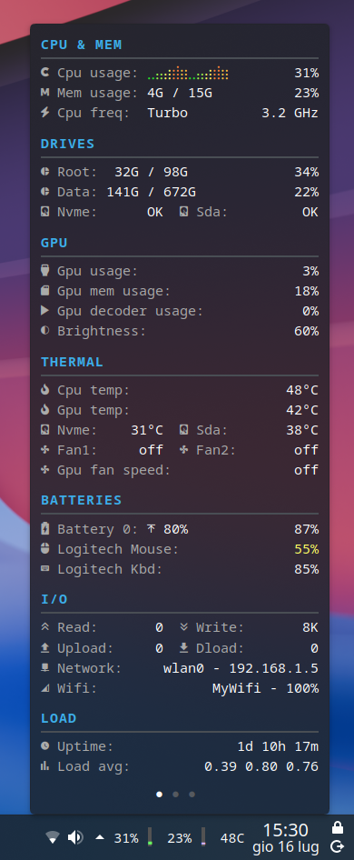
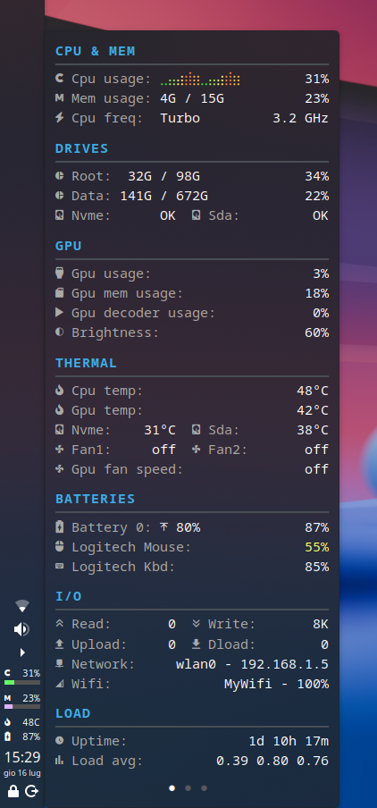
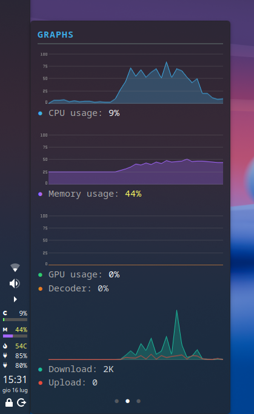
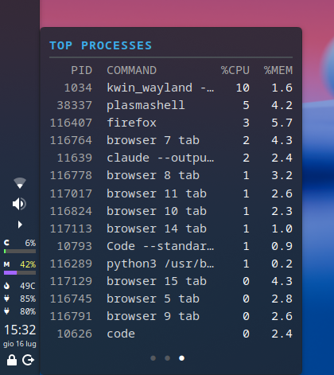
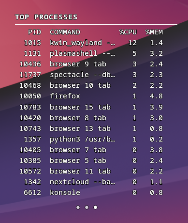
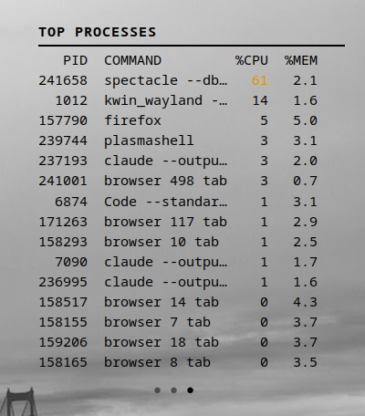

# PlasmaTop

System stats in your **KDE Plasma** panel, plus a rich, paginated tooltip — driven by a lightweight Rust daemon.

<table>
  <tr>
    <td align="center" width="50%"><br><em>Horizontal panel + full stats tooltip</em></td>
    <td align="center" width="50%"><br><em>Vertical panel + full stats tooltip</em></td>
  </tr>
  <tr>
    <td align="center" width="50%"><br><em>Graphs page</em></td>
    <td align="center" width="50%"><br><em>Top processes page</em></td>
  </tr>
  <tr>
    <td align="center" width="50%"><br><em>Desktop mode — transparent, white text</em></td>
    <td align="center" width="50%"><br><em>Desktop mode — transparent, black text</em></td>
  </tr>
</table>

PlasmaTop renders CPU, memory, drives, GPU, temperatures, batteries, network and load as HTML that a bundled Plasma applet displays. The daemon runs in memory and atomically writes the panel and tooltip under `$XDG_RUNTIME_DIR/plasma-top` (falling back to `/tmp/plasma-top-$UID` when unavailable), and the applet just cats them, so display refresh needs no browser, shell pipeline, or per-metric process. Optional command-backed sensors and pages remain isolated behind timeout-bound adapters.

## Features

- **Panel** — compact live stats (usage bars/sparks, temperatures, battery, …), auto-fitted to the panel's size and orientation (horizontal or vertical).
- **Tooltip** — the full stats view on hover, grouped into sections.
- **Deep-dive pages** — scroll the mouse wheel over the widget to page through the tooltip: top processes, per-core CPU, listening connections, fastfetch system info, and history graphs (CPU / memory / GPU / network area charts). Enable and order them in the config.
- **Pin** — middle-click keeps the tooltip open as a persistent popup, so you can watch the graphs live without holding the pointer over the widget.
- **Desktop mode** — drop the widget straight onto the desktop for an always-on, conky-style readout. Choose Plasma's background or keep it transparent on the wallpaper, pick the text and outline colors for legibility over any image, and scroll to page through the views. Set it in the widget's *Appearance* page (the Desktop options appear only when it's on the desktop).
- **Auto light/dark** — follows the Plasma color scheme, hot-reloaded.
- **Per-machine overrides** — sensor mappings and item tweaks auto-detected from the DMI board/product name, so one config works across all your machines.

## Requirements

- **KDE Plasma 6**
- **Rust 1.85+ and Cargo** to build from source; neither is needed after install.
- A **Nerd Font** for the glyphs (the applet defaults to *NotoSansM Nerd Font Mono*). Pick it in the widget's *Appearance* page.
- **Optional feature dependencies**
  - `nvidia-utils` for NVIDIA metrics through NVML or `nvidia-smi`.
  - `iproute2` for the connections page (`ss`).
  - `iw` for Wi-Fi SSID and signal.
  - `fastfetch` for the system info page.

## Install

User-local install is recommended on immutable/Atomic systems and anywhere you do not want root-owned files:

```bash
git clone https://github.com/bogdan-d/plasma-top.git
cd plasma-top
./install.sh
```

This installs below `$HOME/.local` and `$XDG_DATA_HOME` (default `$HOME/.local/share`), activates the user service, and never uses sudo or writes under `/usr`. Add `$HOME/.local/bin` to your interactive shell `PATH` if needed; the service and applet use explicit paths. To build elsewhere, pass an absolute host-compatible binary as `PLASMA_TOP_BINARY=/path/to/plasma-top`. Preview resolved paths and commands without building or changing files with `./install.sh --dry-run` (`--dry` is an alias).

Traditional system-wide install remains available:

```bash
./install.sh --system
```

Both modes build the locked Rust binary, install matching assets, applet, icon, and user service, then activate it. System mode uses `/usr/lib/plasma-top` and `/usr/bin/plasma-top` plus sudo for file installation. Your settings live in ~/.config/plasma-top and are never touched — see [Configuration](#configuration). For checkout-based development, use [docs/DEVELOPMENT.md](docs/DEVELOPMENT.md) instead of the system-wide installer.

Arch packaging metadata lives under `packaging/aur/`. It builds the locked native binary, installs the same applet/assets/service contracts, and has no Python runtime dependency. Maintainers can verify its staged manifest and install/upgrade/uninstall behavior with `tools/p6_package_test.sh`.

Then add the widget: **right-click a panel → Add Widgets → search "PlasmaTop"**.

Re-run the same install command to upgrade. Remove a user install with `./uninstall.sh`, or a system install with `./uninstall.sh --system`. Configuration survives either command. Preview removals with `--dry-run` or its `--dry` alias. If an existing widget keeps stale action paths after switching install modes, remove and re-add that widget; the installer never rewrites Plasma's configuration database.

## Configuration

The installed tree under **/usr/lib/plasma-top/** holds read-only defaults; your overrides go in **~/.config/plasma-top/**. Copy a default across and edit it — everything hot-reloads.

- **config.toml** — behavior and data only (thresholds, glyphs, item order, hardware). Each surface (panel, tooltip) is a set of typed sections (cpumem, thermal, drives, gpu, batteries, io, load) with an order and per-section items. A config.toml in ~/.config/plasma-top replaces the shipped one; run **plasma-top list-items** for the valid metric:form names — it also prints where each one can go. An item listed on a surface it isn't meant for (a bare `cpu_usage:spark`, which carries no label, in a tooltip section) is dropped with a warning on the daemon's log, as is a typo'd name.
- **Machines** — got more than one PC? The shipped machines.toml is just a how-to; list your machines in ~/.config/plasma-top/machines.toml, each with a detection rule and its tweaks. The one matching the current host is merged on top of the config — one synced config works everywhere.
- **Style** — the shipped style/style-dark.css and style-light.css hold colors and spacing; drop a same-named file in ~/.config/plasma-top/style/ to override it. config.toml never carries colors. Glyphs live in style/icons.toml, labels in lang/en.toml.

Everything hot-reloads: editing the TOML/CSS, switching the Global Theme, or moving the panel between edges re-adapts the daemon on the next poll — no restart needed.

## CLI

```bash
plasma-top render                    # render to text in the terminal (no daemon)
plasma-top render --page processes   # render one tooltip deep-dive page (processes|cpu_cores|connections|fastfetch|graphs)
plasma-top probe                     # hardware discovery + raw readings
plasma-top list-items                # valid metric:form tokens
plasma-top profiling                 # per-item timing and cache state
systemctl --user status plasma-top   # the live daemon
```

## How it works

The daemon's pipeline (in `src/`: sensors, formatter, render model, mono renderer) renders stats as monospace-aligned HTML; the applet in `plasmoid/` displays it and publishes live panel geometry back to the daemon, which auto-fits bars and sparks to it. See [docs/](docs/) for the design (DESIGN.md), layout (LAYOUT.md), item catalogue (ITEMS.md) and performance (PERFORMANCE.md) notes.

## License & credits

GPL-2.0-or-later — see [LICENSE](LICENSE).

The Plasma applet under [plasmoid/](plasmoid/) builds on **Command Output** by Chris Holland (Zren) — <https://github.com/Zren/plasma-applet-commandoutput> — also GPL-2.0-or-later. See [NOTICE](NOTICE).
